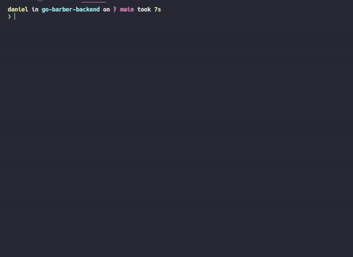

# Go Barber

Projeto feito no Bootcamp da Rocketseat

## 🛠 Technologias usadas:
Node.js, Express, Typescript

### 📘 Libs:
Typeorm, Bcryptjs, Celebrate, Class-transformer, Date-fns, IOredis, Jsonwebtoken, Multer, Nodemailer, Rate-limiter-flexible, TSyringe

## 💽 Bancos de dados

PostgreSQL, MongoDB, Redis

## Features

### ✅ Desenvolvido com design orientado a domínio #DDD
### ✅ Authenticação com JWT
### ✅ Cache
### ✅ Limite de requisições por segundo

### ✅ Testes unitários

Testes unitários com 100% de coverage.



## Requisitos
[Node.js](https://nodejs.org) com versão acima da 14.x

Um banco [PostgreSQL](https://www.postgresql.org) rodando na porta padrão <br>
Um banco [MongoDB](https://www.mongodb.com) rodando na porta padrão <br>
Um banco [Redis](https://redis.io) rodando na porta padrão

Certifique-se que todos os bancos estão rodando, recomendo o uso do [Docker](https://www.docker.com) neste caso.

## Como rodar a API:
  * Clone este repositório
  * Vá para pasta principal
  * Download das depêndencias usando o Yarn:
  ```shell
    $ yarn
  ```

  * Download das depêndencias usando o Npm:
  ```shell
    $ npm i
  ```

  * Iniciando a API com Yarn:
  ```shell
    $ yarn dev:server
  ```

  *Iniciando a API com Npm
  ```shell
    $ npm dev:server
  ```
  * Porta da API: 3333

 ## Author
 ### Daniel Vidal
 * GitHub: https://github.com/denion465
 * Linkedin: https://www.linkedin.com/in/daniel-vidal465
